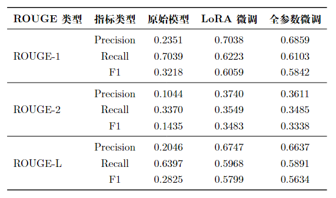
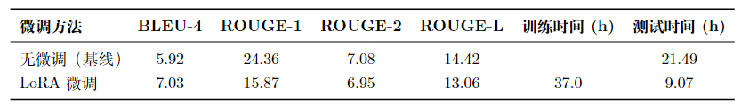

# MedQA-ChatGLM-LK

本项目重在学习和理解大模型微调技术，借鉴已有微调ChatGLM项目（https://github.com/WangRongsheng/MedQA-ChatGLM  对其提供的数据集、代码逻辑以及相关运行方式进行完善和修改），对ChatGLM-6B模型进行医学Lora微调，重在学习、理解和实践，同时同组成员使用全参数微调和Lora微调技术对Qwen3-1.7B进行医学微调，微调效果更加明显，对于学习和理解更有帮助，是本项目的优化版本，也可进行参考和学习。

# 安装
```
cd .../MedQA-ChatGLM-LK/
pip install -r requirements.txt
```
# 项目结构
```
MedQA-ChatGLM-LK
|
|-- checkpoints#保存模型微调的权重
|   |-- ...
|   |-- ...
|   |-- ...
|-- images#结果展示
|   |-- ...
|   |-- ...
|   |-- ...
|-- data#数据集的json文件
|   |-- ...
|   |-- ...
|   |-- ...
|-- docs#参数解析
|   |-- ...
|   |-- ...
|   |-- ...
|-- MedQA-ChatGLM#核心代码
|   |-- ...
|   |-- ...
|   |-- ...
|   
|-- README.md
|-- requirements.txt
```
# 运行

微调使用数据集：merged-cMedQA

测试使用数据集：Huatuo

## ChatGLM-6B 模型的命令示例：

```
ChatGLM-6B 模型微调CLI：
单卡微调：
CUDA_VISIBLE_DEVICES=0 python MedQA-ChatGLM/finetune.py \
--do_train \
--dataset merged-cMedQA \
--dataset_dir data \
--split train \
--finetuning_type lora \
--resume_lora_training \
--plot_loss \
--per_device_train_batch_size 8 \
--gradient_accumulation_steps 256 \
--lr_scheduler_type cosine \
--logging_steps 500 \
--save_steps 1000 \
--learning_rate 5e-5 \
--num_train_epochs 10.0 \
--fp16 \
--output_dir ./checkpoints/output_dir/\
train_lora_single_gpu_merged-cMedQA \
2>&1 | tee train_lora_single_gpu_merged-cMedQA.log


多卡微调：
# 配置分布式参数
accelerate config
accelerate launch ./MedQA-ChatGLM/finetune.py \
--do_train \
--dataset merged-cMedQA \
--finetuning_type lora \
--per_device_train_batch_size 8 \
--gradient_accumulation_steps 4 \
--lr_scheduler_type cosine \
--logging_steps 10 \
--save_steps 1000 \
--learning_rate 5e-5 \
--num_train_epochs 3.0 \
--fp16 \
--ddp_find_unused_parameters False \
--plot_loss \
--output_dir ./checkpoints/output_dir/\
train_lora_multi_gpu_merged-cMedQA \
2>&1 | tee train_lora_multi_gpu_merged-cMedQA.log


评估：
# 加载lora
CUDA_VISIBLE_DEVICES=5 python MedQA-ChatGLM/finetune.py \
--do_eval \
--dataset Huatuo \
--dataset_dir data \
--split train \
--finetuning_type lora \
--checkpoint_dir ./checkpoints/output_dir/\
train_lora_multi_gpu_merged-cMedQA/checkpoint-53000 \
--output_dir ./med-lora-eval \
--per_device_eval_batch_size 8 \
--predict_with_generate True \
--fp16 \
2>&1 | tee eval_my_lora_single_gpu_Huatuo.log


# 不加载lora
CUDA_VISIBLE_DEVICES=0 python MedQA-ChatGLM/finetune.py \
--do_eval \
--dataset Huatuo \
--dataset_dir data \
--split train \
--finetuning_type none \
--output_dir ./med-lora-eval \
--per_device_eval_batch_size 8 \
--predict_with_generate True \
--fp16 \
2>&1 | tee eval_no_lora_single_gpu_Huatuo.log
```


## Qwen3-1.7B 微调项目

跳转：https://github.com/InceptionStep/-Qwen3-1.7B-.git

结果展示：



# 结果展示

**在 Huatuo 测试集上的评估结果如下：**



# checkpoints下载

./checkpoints/output_dir/train_lora_multi_gpu_merged-cMedQA/checkpoint-53000
checkpoint-53000：
链接: https://pan.baidu.com/s/1uJgIqs45-teevlctPnaHmA?pwd=fm77 提取码: fm77


